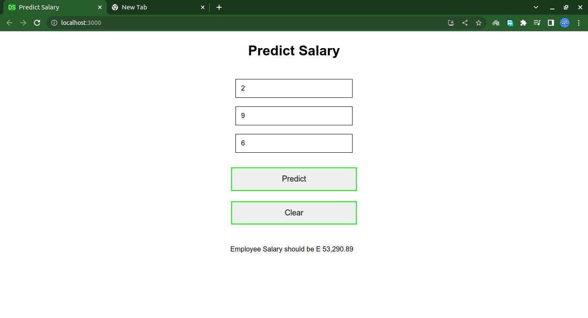

# Salary Prediction ML Model Deployment

## Author: 
Dominic Samo, BSc Computer Science and Physics, Certified Data Scientist and Software Engineer


## Environment Used To Code and Deploy React Web App
* Visual Studio Code
* Ubuntu 22.04 LTS
* This project was bootstrapped with [Create React App](https://github.com/facebook/create-react-app).

## React
  React is a free and open-source front-end JavaScript library for building user interfaces based on components. It is maintained by Meta and a community of individual developers and companies.
  * In order to run any React app locally using React one has to install Node.js in their system.
  * Since I use Ubuntu, I followed the article found [here](https://www.digitalocean.com/community/tutorials/how-to-install-node-js-on-ubuntu-20-04).
  

## Package used to handle HTTP Requests 
Axios
* Axios is a promise-based HTTP Client for node.js and the browser. It is isomorphic (= it can run in the browser and nodejs with the same codebase). On the server-side it uses the native node.js http module, while on the client (browser) it uses XMLHttpRequests [(Axios, 2023)](https://axios-http.com/docs/intro). 

## Clonning the React Application

* Clone the repository
* Open the directory and from there, open it in a Terminal/Command Line
* **NB:** The directory should look like the Directory Tree below.
* Type: $ ```npm install```
* The command above will install all the required packages required by the application. 

## Directory Tree
```
├── package.json
├── public
│   ├── favicon.ico
│   ├── index.html
│   ├── logo192.png
│   ├── logo512.png
│   ├── manifest.json
│   └── robots.txt
├── README.md
└── src
    ├── App.css
    ├── App.js
    ├── index.css
    ├── index.js
    ├── logo.svg
    ├── Predict.jsx
    └── style.css

```

## Running the React Application

* Type: $ ```npm start```
* The application should start and it will open on the browser
* The application will run locally on the URL ```http://127.0.0.1:3000/```
* The URL will open in your favorite/default web browser where a window similar to theone below will be opened.
* Enter the required numbers in input boxes and then click ```Predict```.
* A prediction will be shown.

## Prediction from React Web App

* A React web app running on a browser showing a prediction. It is using the ```predict_api()``` function.
* Click [here](https://github.com/DominicSamoes/ml-model-deployment-flask) to go to the Flask web app's repository and documentation.
* The app is running on ```http://127.0.0.1:3000```
* The API is running on ```http://127.0.0.1:5000```



## Attribution

If you liked my work, you can Star the project on GitHub and reference me whenever you spin your own version of the work. 

---

### Let's Connect On LinkedIn
**LinkedIn** - https://www.linkedin.com/in/dominic-samo-754014187/